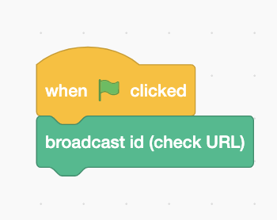
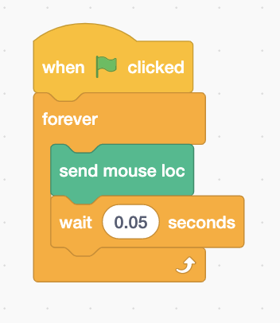

## ⚡ Quick Setup️

Requirements
1. Your java version should be 8 or higher. Check `java -version`.
2. Install node.js https://nodejs.org/en/ (tested with Linux version 6.13.4 and Mac)

```shell script
git clone git@github.com:mitmedialab/prg-extension-boilerplate.git
# Cloning the full history (300mb) takes about 20 seconds on fast internet. Include -–depth 1 for a 4 second checkout
npx lerna bootstrap --force-local
# This will symlink the packages together to allow for seamless local development, and installs dependencies for each package
# Takes about 1.5 minutes
cd packages/scratch-vm
npm install
yarn link
cd ..
cd scratch-gui
npm install
yarn link scratch-vm
npm start

# Open http://localhost:8601/ in your browser

# IMPORTANT!! In a separate terminal window, navigate to packages/scratch-gui and run
node index.js
# A future addition will to be to run both servers within one npm start command.
```

Now you can make changes, and they will auto-build from the scratch-gui watcher and live-reload!

To use our PRG Collaborative UI blocks, first make sure our websocket server is running as stated above.

Then, to create a new room, just run the broadcast block.



A roomID will show up in your URL after localhost:8601. Copy this roomID and send it to your joining client.

On your joining client's side, run a join block with the ID of the room you'd like to join.


A new window will pop up that will be connected to your host's room. (Note: for some reason, when testing locally, this only works when running in two different types of browsers, i.e. Safari vs. Chrome).

Then, you can broadcast your client's mouse location to the other client! An example block of doing this is below.


